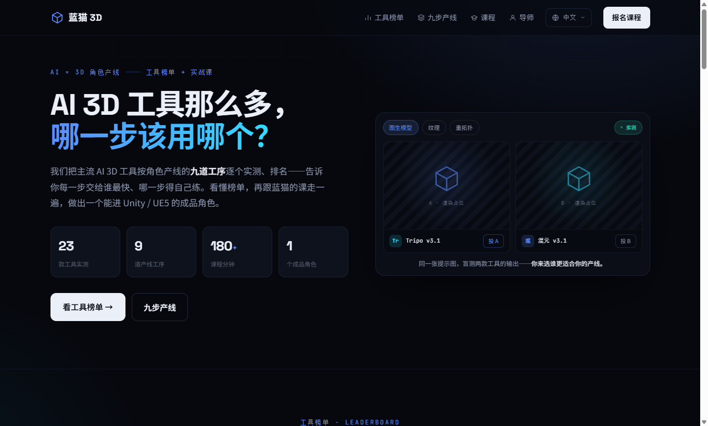

<div align="center">

# 🧊 蓝猫 3D



> *「工具那么多，缺的从来不是工具，是知道**哪一步该用哪个**。」*

[](https://3d.bluecatbot.com/zh/)


**把 23 款主流 AI 3D 工具按角色产线的九道工序逐个盲测排名，再用一套贯穿实战课，带你从一句提示词做出能进 Unity / UE5 的成品角色。**

<sub>不是又一个「AI 工具大全」列表 —— 是告诉你每一步**交给谁最快、哪一步得自己练**的产线地图。</sub>

[看效果](#-效果示例) · [▶ 在线体验](#-在线体验) · [九步产线](#-九步产线它教什么) · [工具榜单](#-工具榜单它测了什么) · [背后的故事](#-背后的故事)

</div>

---

## 🔥 效果示例

打开首页第一屏，就是一张 **A/B 盲测卡**——同一个提示词，两款工具的输出并排，标签藏成 A / B，你先选哪个更适合你的产线，再翻开是谁：

<div align="center">

</div>

产线上的每一道工序，榜单都给一个**实测分**（8.0 – 9.2），不是厂商宣传页的星级：

| 工序 | 头名工具 | 分数 | 这一步的判断 |
|---|---|:--:|---|
| 3D 模型生成 | **Rodin Gen 2.5** | 9.2 | AI 提速——一句话到白模，省下最枯燥的起形 |
| 概念设定 | **Tripo AI v3.1** | 9.0 | AI 提速——多方案盲出，挑一个再往下走 |
| 上色 + 材质 | **Meshy** | 8.7 | AI + 手修——AI 铺底，PBR 参数自己收 |
| 重拓扑 / 绑定 | **Blender** | — | 蓝猫带练——这几步 AI 还靠不住，得自己练 |

> **看懂榜单，你就知道钱和时间该花在哪一步——而不是把九步全丢给 AI，最后收一个进不了引擎的废模型。**

## ▶ 在线体验

**[👉 3d.bluecatbot.com](https://3d.bluecatbot.com/zh/)** —— 榜单、九步产线详情、实战课，打开即看，无需登录。

本地跑一份也就两行：

```bash
python build_site.py                      # 纯标准库，生成 out/
cd out && python -m http.server 5018      # 打开 http://127.0.0.1:5018/zh/
```

<details>
<summary>改内容 / 加语言怎么做</summary>

- **改首页 / 榜单分数 / 课程定价** → 改 `src/templates/home.html`
- **改某一步产线详情** → 改 `src/data/modules/NN.json`（`sections[]` 有序类型块，一个 `r_*()` 渲染函数一类）
- **加英/日语** → `build_site.py` 的 `LANGS` 加语言 + 复制 `home.<lang>.html` + 补 `i18n/<lang>.json`
- 详见 [`CLAUDE.md`](./CLAUDE.md)

</details>

## 🧭 九步产线（它教什么）

一个贯穿项目，九道工序，每步都带**硬规则 · 可复制 prompt · 常见翻车 · 交付物清单 · 自检**：

| # | 工序 | 谁来做 |
|:--:|---|---|
| 01 | 概念设定 | 🟦 AI 提速 |
| 02 | 3D 模型生成 | 🟦 AI 提速 |
| 03 | 雕刻 | 🟪 AI + 手修 |
| 04 | 重拓扑与优化 | 🟣 蓝猫带练 |
| 05 | UV 展开 | 🟪 AI + 手修 |
| 06 | 纹理烘焙 | 🟪 AI + 手修 |
| 07 | 上色 + 材质 | 🟦 AI 提速 |
| 08 | 绑定 + 动画 | 🟣 蓝猫带练 |
| 09 | 导出到引擎 | 🟪 AI + 手修 |

**产线的价值不在「AI 能做全部」，而在诚实地标出哪三步 AI 还替不了你。**

## 📊 工具榜单（它测了什么）

- **23 款工具**跑同一套角色产线，**9 道工序**逐步盲测；
- 每步给实测分（8.0–9.2）+ 一句「这步交给它值不值」；
- Rodin Gen 2.5 / Tripo AI v3.1 / Meshy / 3D AI Studio / Blender … 覆盖 AI 生成到手工精修全链。

## 🎓 实战课

| 档位 | 价格 | 给谁 |
|---|:--:|---|
| **散养** | ¥999 | 自己啃得动，要一套体系化的产线地图 + 全部内容 |
| **亲传** | ¥3999 | 要蓝猫盯着走完一遍成品角色（每月限 10 席） |

## ⚙️ 工作原理

1. **一份数据，一个模板**——`src/data/modules/*.json` 是内容真相源，`build_site.py` 纯 Python 渲染。
2. **首页忠实复刻设计稿**——不是凭数据重写，而是照 `design/` 的 standalone 落成干净自包含模板。
3. **静态产物**——`build_site.py` 一跑生成 `out/`，nginx root 直出，**零运行时依赖、零数据库**。
4. **三语架构就位**——一语一文件、`build_site` 按语言择源，加语言只是补文件。

## 🙏 诚实边界

- **线上目前只有中文**：英 / 日语的架构已就位，文案待补——别指望现在切到 `/en/`。
- **榜单是人工盲测策展，不是自动化跑分**：分数带主观判断，工具迭代快，会过时，请当参考不当圣旨。
- **课程是付费的**：README 教你产线怎么想，成体系的手把手在课里。
- **不替你练手上功夫**：重拓扑、绑定这些标🟣的步骤，工具帮不上，只能自己下功夫。

## 📖 背后的故事

做 3D 角色的人现在最大的痛不是「没有 AI 工具」，是**工具太多、每个都说自己最强，没人告诉你一条完整产线上每一步到底该用哪个**。于是要么把九步全丢给 AI 收一个进不了引擎的废模型，要么退回纯手工白白错过能提速的那几步。

蓝猫 3D 想做的就是那张缺失的**产线地图**：把工具拉到同一个真实项目里盲测，用分数和「谁来做」的标注，把「AI × 手工」的边界画清楚——看懂它，你自己就能判断，而不必再被一个个工具的宣传页牵着走。

## 👤 关于作者

**蓝猫 · BlueCat** —— AI-native builder，做能上线的中英日三语产品。

| | |
|---|---|
| 🌐 站点矩阵 | [bluecatbot.com](https://bluecatbot.com) |
| 🐙 GitHub | [@shushuitie2017](https://github.com/shushuitie2017) |

### 也在做

- 🎨 **[矢安 SVGSafe](https://svg.bluecatbot.com)** —— 授权清晰的免费 SVG 图标 / 插画库，6000+ 张
- ✍️ **[vlog 三语博客](https://vlog.bluecatbot.com)** —— 12 位母语作者、每日更新的中英日技术/心理/健康/科普
- 🐱 **[蓝猫学 Claude](https://learn.bluecatbot.com)** —— 儿童向 Claude 互动小课本
- 🔍 **[SEO 体检](https://seo.bluecatbot.com)** —— 在线 17 项 SEO 诊断 + 复制即用修复

## 📄 许可证

**MIT —— 随便用，随便改，随便造。**

---

<div align="center">

*工具那么多，缺的从来不是工具，是知道哪一步该用哪个。*

**[▶ 打开蓝猫 3D](https://3d.bluecatbot.com/zh/)**

</div>
